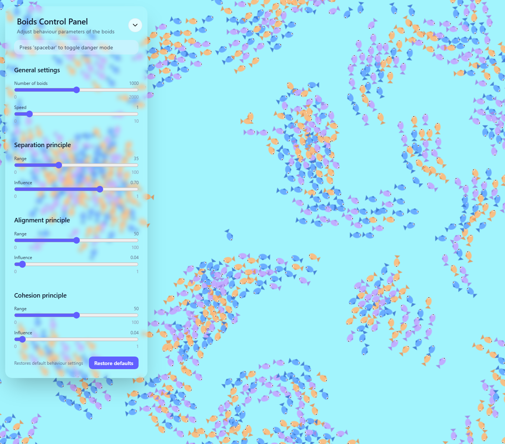

# Projekt nr. 60 - Symulacja ruchu ryb

### Autorzy pracy

- Aleksander Stanoch

- Sebastian Abramowski

### Informacje ogólne

**Algorytm boids** to prosty sposób na symulację zachowania stada, w naszym przypadku ryb. Polega na tym, że `każda ryba w ławicy patrzy na swoje bliskie otoczenie oraz stosuje się do trzech zasad`:

- _Zasada Rozdzielności_ - zapobiega tworzeniu tłumu w jednym miejscu, pojedyncza ryba stara się utrzymywać bezpieczną odległość od innych, bo nie chce być zbyt blisko sąsiednich ryb

- _Zasada Spójności_ - pojedyncza ryba stara się trzymać blisko lokalnej grupy ryb i nie chce odpłynąć od nich za daleko (fizyka: ryba chce się przesunąć w kierunku środka masy swoich bliskich sąsiadów)

- _Zasada Wyrównania_ - pojedyncza ryba dostosowuje swój kierunek ruchu do innych ryb w pobliżu, żeby płynąć w podobnych sposób jak reszta lokalnej grupy

### Symulacja online

https://hrober0.github.io/BoidsJS/

### Optymalizacja - spacial hashing

Moduł implementuje strukturę danych **Spatial Hash**, umożliwiającą szybkie wyszukiwanie obiektów w pobliżu danej pozycji. Jest szczególnie przydatny w symulacjach **Boids** i zachowań rojowych, gdzie każdy agent oddziałuje tylko z najbliższymi sąsiadami.

#### Zasada działania

Świat dzielony jest na **siatkę kwadratowych komórek** (`cellSize`). Każdy obiekt trafia do odpowiedniej komórki na podstawie swojej pozycji:

```ts
index = Math.floor(x / cellSize) + Math.floor(y / cellSize) * cellsX;
```

Przy wyszukiwaniu sąsiadów sprawdzane są tylko komórka, w której znajduje się obiekt, oraz komórki sąsiednie. Dzięki temu unikamy porównywania wszystkich obiektów ze sobą.

Struktóra udostpępnia dwie metody:

- `build(items: T[])` — buduje hash z listy obiektów. Każdy obiekt musi posiadać position: { x: number, y: number }.
- `query(position: Vector2, range: number, callback: (item: T) => void)` — wywołuje callback dla wszystkich obiektów znajdujących się w promieniu range od podanej pozycji.

#### Korzyści wydajnościowe

Bez użycia spatial hash symulacja Boids wymaga sprawdzania odległości między wszystkimi agentami, co daje złożoność `O(n²)`. Z spatial hash:
Sprawdzane są tylko obiekty w pobliskich komórkach.
Efektywna złożoność spada do około `O(n)`.
Pozwala to na symulację tysięcy agentów w czasie rzeczywistym.

### Przykłady działania symulacji

#### Ogólne działanie symulacji


#### Przykład dużego wpływu `zasady rozdzielności`


#### Przykład dużego wpływu `zasady spójności`


#### Przykład dużego wpływu `zasady wyrównania`


#### Przykład trybu `danger mode`


#### Panel do sterowania symulacją


