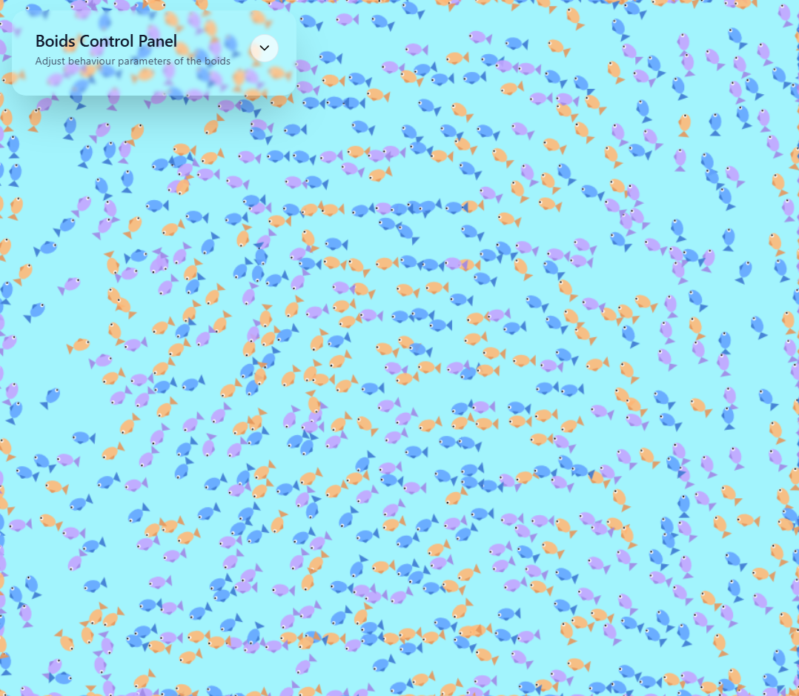
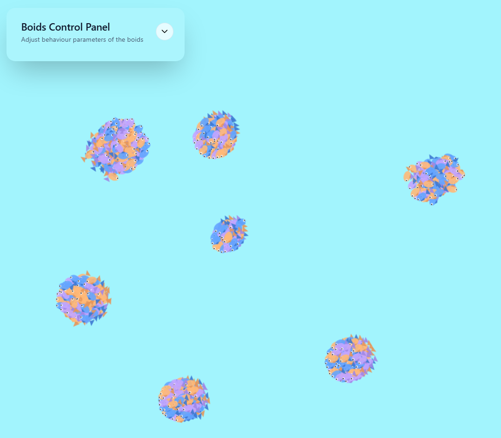
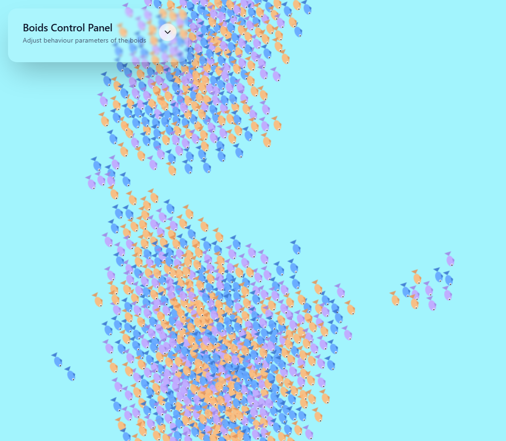
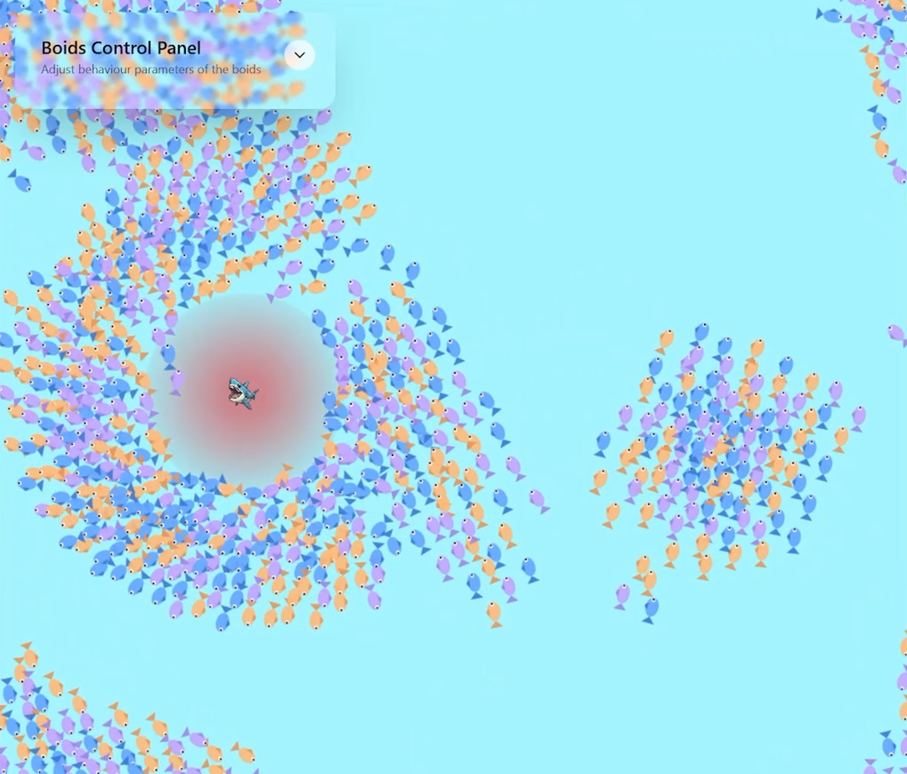

# Projekt nr. 60 - Symulacja ruchu ryb

### Autorzy pracy

- Aleksander Stanoch

- Sebastian Abramowski

### Informacje ogólne

**Algorytm boids** to prosty sposób na symulację zachowania stada, w naszym przypadku ryb. Polega na tym, że `każda ryba w ławicy patrzy na swoje bliskie otoczenie oraz stosuje się do trzech zasad`:

- _Zasada Rozdzielności_ - zapobiega tworzeniu tłumu w jednym miejscu, pojedyncza ryba stara się utrzymywać bezpieczną odległość od innych, bo nie chce być zbyt blisko sąsiednich ryb

- _Zasada Spójności_ - pojedyncza ryba stara się trzymać blisko lokalnej grupy ryb i nie chce odpłynąć od nich za daleko (fizyka: ryba chce się przesunąć w kierunku środka masy swoich bliskich sąsiadów)

- _Zasada Wyrównania_ - pojedyncza ryba dostosowuje swój kierunek ruchu do innych ryb w pobliżu, żeby płynąć w podobnych sposób jak reszta lokalnej grupy

### Optymalizacja - spacial hashing

TODO

### Przykłady działania symulacji

#### Ogólne działanie symulacji

#### Przykład dużego wpływu `zasady rozdzielności`

#### Przykład dużego wpływu `zasady spójności`

#### Przykład dużego wpływu `zasady wyrównania`

#### Przykład trybu `danger mode`

